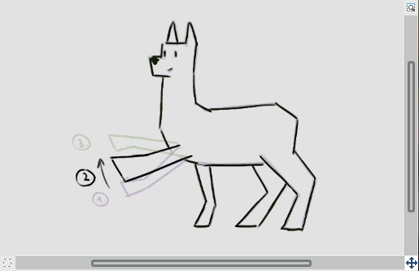
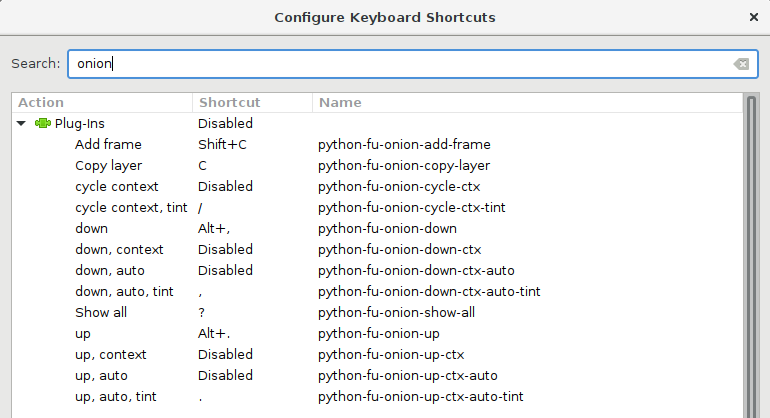
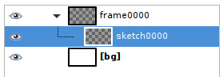
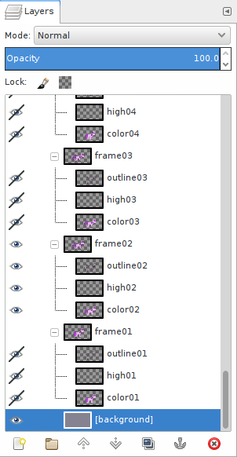

# GIMP onion layers plug-in

Onion layers is a plug-in for the [GIMP](https://www.gimp.org/) drawing
program. It provides some convenient shortcuts for moving up and down the stack
of frames when making hand-drawn animations, as well as some other useful
functions. It's based on the concept called *onion layering*, where the frame
you are currently working on is overlaid with the previous and next frames to
aid in drawing.

Currently it provides the following functions that can be assigned to keyboard
shortcuts:

 *  Switch to next/previous frame, optionally showing some neighboring frames.
 *  Cycle through showing no neighboring frames, only next frame, only previous
    frame, or both next and previous frames.
 *  Show all frames will full opacity.

Some other useful functions when drawing animations where each frame consists
of multiple layers are also included:

 *  Copy a layer to all frames.
 *  Add a new frame, taking the layers in the current one as a template.

## Installation

To install the plug-in, copy the `onion_layers.py` file to `[your home folder]\.gimp-[GIMP version]\plug-ins`.

If you have GIMP 2.8 on Linux, running `make install` should do the right
thing. The plug-in will likely not work on Windows as-is (patches would be welcome)

The plug-in was developed for GIMP 2.8.18 and Python 2.7.13. It might also work
with other versions - feedback regarding that is welcome.

## Usage

Functions provided by the plug-in can be found in the GIMP menu under "Filters
-> Animation -> Onion layers".

You want to assign keyboard shortcuts to them however. Go to "Edit -> Keyboard
Shortcuts" and search for "onion". A good choice of shortcuts for previous/next
frame functions are period and comma keys on a US keyboard. They shouldn't
conflict with other GIMP shortcuts and match the frame skip shortcuts on some
video players.

Following shows the list of available functions as well as a suggestion on what
keys to assign to them:

The plug-in assumes that each top-level layer or layer group represents one
animation frame. You should have layers named consistently: top-level groups
named "frame0000", "frame0100", etc. and then layers inside named using the same
pattern.

The layer on top of the stack is the *last* layer (same ordering is used for
animated GIF functions that are built into GIMP). Hence frame numbers are
typically shown in falling order in GIMP's Layers dialog.

If you have background layers that are common to all frames, you can put
[brackets] around their names and they will be ignored by this plug-in. This is
consistent with how the [Export
Layers](https://github.com/khalim19/gimp-plugin-export-layers) used to handle
background layers.

A good start is the setup shown below (you can find it in the `template.xcf`
file included in the repository):

"[bg]" contains the background, "frame0000" is the layer group representing
the first frame of the animation and "sketch0000" is the first layer in that
frame. Draw something on "sketch0000" and then add a new frame by presssing "C"
(`python-fu-onion-add-frame`). This should add "frame0100" and "sketch0100".

By numbering frames with 100, 200, 300, ... instead of 1, 2, 3, ... you can
later insert inbetween frames without renaming all your key frames. This might
help you if you've already inserted your keyframes into some video editing
software.

A file with more layers per frame may look like this. Each frame has an
outline, a shading and a color layer:

### Onion layer up/down functions

The `python-fu-onion-down-ctx-auto-tint` and `python-fu-onion-up-ctx-auto-tint`
functions change the visibility and opacity of top-level layers or groups one
step up or down.

The currently active frame will be given full opacity, frames one step above
and below in the stack (if shown) will be given 25% opacity. They will also be
slightly tinted green (next) and purple (previous). Other layers will be hidden.

The active layer (the layer where the drawing tools have effect) will be
changed accordingly as well, if you are using the recommended layer naming scheme.

The tinting of layers is done by adding two layers to your image
("onion-tint-before", "onion-tint-after"). If you find that this makes GIMP too
slow or you don't like tinting, you can use the identical functions without the
"-tint" in their names.

The `python-fu-onion-up` and `python-fu-onion-down` functions work in the same
way, except that they force the neighboring frames not to be shown. This is
sometimes useful to quickly reduce clutter.

### Selecting neighboring layer visibility

The `python-fu-onion-cycle-ctx-tint` function will cycle through the four possible
settings for the visibility of neighboring frames:

 *  No neighboring frames shown,
 *  both previous and next frames shown,
 *  only next frame shown and
 *  only previous frame shown.

Display of neighboring frames gives best results when working on black outlines
on transparent background. If you have frames colored-in, it's best to not show
neighboring frames.

The `python-fu-onion-cycle-ctx` function does the same thing, except it does
not use tinting layers.

### Preparing frames for export

The `python-fu-onion-show-all` can be used to reset the visibility and opacity
of all layers. This is useful before exporting the layers using *Export
Layers*, since otherwise some frames might get exported with reduced opacity.

This function also cleans up the tinting layers.

### Other useful things

`python-fu-onion-copy-layer` will copy currently active layer to all frames. It
will rename the copies to keep the correct naming scheme.

If a layer with such a name already exists in a frame, it will only copy over
opacity and visibility. Hence this function is useful both to add a layer to
all frames as well as quickly show or hide a layer in all frames.

`python-fu-onion-add-frame` will add a new frame above (i.e. appearing after)
the currently active one. The new frame will have a number between the two
existing frames. It will also create blank layers inside the new group, taking
the current frame as a template.

If there is no space for a new number (i.e. frames already have consecutive
numbers) it will refuse to do anything. You can renumber frames using
`python-fu-onion-renumber-frames` to fix this.

`python-fu-onion-copy-layer` and `python-fu-onion-add-frame` only work when
frames are layer groups, not single frames.

`python-fu-onion-convert-to-groups` will convert any top-level, non-background,
bare layers into groups. This is useful after importing individual frames into
GIMP using "File -> Open as Layers..."

`python-fu-onion-enable-frame` and `python-fu-onion-disable-frame` will make
the current frame a background layer and vice-versa. This is useful for quickly
removing and re-adding frames from and to the onion stack.

`python-fu-onion-renumber-frames` will renumber all your layers. Use this if
you've run out of numbers for inbetweens.

## Known problems

If `-up` and `-down` functions don't do anything, make sure that you have at
least one top-level layer or group visible and at 100% opacity.

Changing layer visibility and opacity clutters the undo history. Unfortunately
there is no way for a plug-in to manipulate the undo history. The code makes
sure to do its thing with as few undo steps as possible, but fundamentally this
is a limitation of the GIMP plug-in interface.

## License

GIMP onion layers plug-in is Copyright (C) 2020 Tomaž Šolc tomaz.solc@tablix.org

This program is free software: you can redistribute it and/or modify it under
the terms of the GNU General Public License as published by the Free Software
Foundation, either version 3 of the License, or (at your option) any later
version.

This program is distributed in the hope that it will be useful, but WITHOUT ANY
WARRANTY; without even the implied warranty of MERCHANTABILITY or FITNESS FOR A
PARTICULAR PURPOSE.  See the GNU General Public License for more details.

You should have received a copy of the GNU General Public License along with
this program.  If not, see http://www.gnu.org/licenses/
