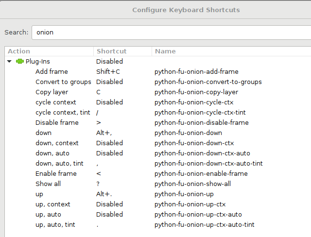

# GIMP onion layers plug-in

Onion layers is a plug-in for the [GIMP](https://www.gimp.org/) drawing
program. It provides some convenient shortcuts for switching between frames
when making hand-drawn animations. It uses the concept sometimes called *onion
layering*, where the frame you are currently working on is overlaid with the
previous and next frames to aid in drawing.

Currently it provides the following functions that can be assigned to keyboard
shortcuts:

 *  Switch to previous/next frame, showing neighboring frames with reduced opacity.
 *  Switch to previous/next frame and show only that frame.
 *  Show all frames will full opacity.

## Installation

To install the plug-in, copy the `onion_layers.py` file to `[your home folder]\.gimp-[GIMP version]\plug-ins`.

If you have GIMP 2.8 on Linux, running `make install` should do the right thing.

The plug-in was developed for GIMP 2.8.14 and Python 2.7. It might also work
with other versions - feedback regarding that is welcome.

## Usage

Functions provided by the plug-in can be found in the GIMP menu under "Filters
-> Animation -> Onion layers".

You probably want to assign keyboard shortcuts to them however. Go to "Edit ->
Keyboard Shortcuts" and search for "onion". A good choice of shortcuts for
previous/next frame functions are period and comma keys on a US keyboard. They
shouldn't conflict with other GIMP shortcuts and match the frame skip shortcuts
on some video players.

The plug-in assumes that each top-level layer or layer group represents one
animation frame. If you have background layers that are common to all frames,
you can put brackets around their names and they will be ignored by this
plug-in. Note that this is consistent with how the [Export
Layers](https://github.com/khalim19/gimp-plugin-export-layers) handles layers.

The `python-fu-onion-down-ctx` and `python-fu-onion-up-ctx` functions change
the visibility and opacity of top-level layers or groups one step up or down.

The currently active frame will be given full opacity, frames one step above
and below in the stack will be given 25% opacity. Other layers will be hidden.
This is most useful when working on outlines.

The active layer (the layer where the drawing tools have effect) will be
changed accordingly as well. The plug-in uses some simple heuristics to
identify matching layers inside groups. It's best to use a naming scheme shown
in the screenshot above (e.g. nameXX where XX is the number of the frame).

The `python-fu-onion-up` and `python-fu-onion-down` functions work in the same
way, except that neighboring frames are not shown. This is sometimes useful to
reduce clutter.

The `python-fu-onion-show-all` can be used to reset the visibility and opacity
of all layers. This is useful before exporting the layers using *Export
Layers*, since otherwise some frames might get exported with reduced opacity.

## Known problems

If `-up` and `-down` functions don't do anything, make sure that you have at
least one top-level layer or group visible and at 100% opacity.

Changing layer visibility and opacity clutters the undo history. Unfortunately
there is no way for a plug-in to manipulate the undo history. The code makes
sure to do its thing with as few undo steps as possible, but fundamentally this
is a limitation of the GIMP plug-in interface.

## License

GIMP onion layers plug-in is Copyright (C) 2017 Tomaž Šolc tomaz.solc@tablix.org

This program is free software: you can redistribute it and/or modify it under
the terms of the GNU General Public License as published by the Free Software
Foundation, either version 3 of the License, or (at your option) any later
version.

This program is distributed in the hope that it will be useful, but WITHOUT ANY
WARRANTY; without even the implied warranty of MERCHANTABILITY or FITNESS FOR A
PARTICULAR PURPOSE.  See the GNU General Public License for more details.

You should have received a copy of the GNU General Public License along with
this program.  If not, see http://www.gnu.org/licenses/
